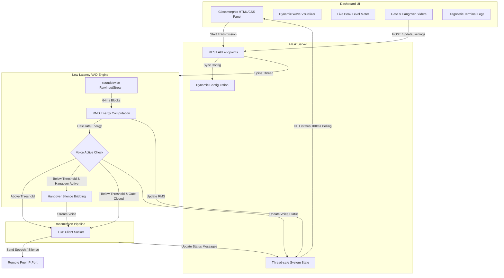

# 🎤 VoxGate: Premium Real-Time Speech Gating & Transmission Pipeline

VoxGate is a professional-grade, low-latency real-time voice streaming system. It captures local audio via the microphone, runs an advanced **Voice Activity Detection (VAD) engine** with dynamic attack/release hangover times, filters background room noise, and streams the speech over a raw TCP socket to a remote recipient.

It features a stunning, state-of-the-art **glassmorphic dark-mode dashboard** that displays live peak volume meters, a dynamic CSS audio wave visualizer, dynamic threshold gating overlays, real-time parameter tuning, and a diagnostic logging console.

---

## ✨ Features

*   **🎙️ Smart Voice Activity Detection (VAD)**: A noise gate that continuously monitors raw RMS audio energy and automatically streams speech while filtering background room static.
*   **⏳ VAD Hangover Time (Silence Bridging)**: Keeps streaming actual audio for a configurable trailing period (e.g., `500ms`) after speech levels drop below the threshold. This prevents clipping/chopping trailing syllables or short natural pauses.
*   **⚡ Ultra-Low Latency**: Audio block capture is optimized to `1024` samples (at `16kHz`), slashing audio capture buffering latency from **256ms** to **64ms** for immediate speech processing.
*   **🔗 Bulletproof Socket Lifecycle**: Features a `5.0` second socket connection timeout to prevent hanging the server thread, with automatic error handling, state cleanup, and UI warnings on network disconnections.
*   **📊 Real-Time Volume Visualizer**: A beautiful horizontal RMS meter showing audio input level peaks dynamically. An overlay **Gate threshold marker** lets you visually align the gate with your vocal peaks.
*   **🌊 Dynamic Audio Waveform**: A 15-bar interactive sound wave that dances in real-time, glowing in deep blue when connected and transitioning to bright neon green during active speech.
*   **⚙️ On-The-Fly Customization**: Adjust your **Noise Gate Threshold** and **Hangover Time** instantly with responsive sliders that sync with the running backend without interrupting transmission.
*   **💻 Diagnostic Log Terminal**: A built-in dark logging terminal displaying system events and socket connection logs with precise microsecond timestamps.

---

## 📐 System Architecture



---

## 🚀 Getting Started

### 📋 Prerequisites

Ensure you have Python 3 installed. You will need to install the following core packages:

```bash
pip install sounddevice numpy scipy flask
```

> [!NOTE]
> On Linux systems, `sounddevice` depends on the **PortAudio** system library. If you encounter issues during installation, install it via your package manager:
>
> ```bash
> # Debian/Ubuntu
> sudo apt-get install libportaudio2
> 
> # RedHat/Fedora
> sudo dnf install portaudio
> ```

### 🏃 Running the Application

1. Clone or navigate to the project directory:
   ```bash
   cd stt
   ```
2. Start the local server:
   ```bash
   python3 server.py
   ```
3. Open your browser and navigate to:
   ```
   http://localhost:5000
   ```

---

## 🛠️ Configuration Details

| Parameter | Default Value | Recommended Range | Description |
| :--- | :--- | :--- | :--- |
| **Target IP** | `192.168.1.11` | IPv4 Address | The IP address of the receiver socket listening for the speech stream. |
| **Port** | `5000` | `1024 - 65535` | The TCP port of the remote listener. |
| **Noise Threshold** | `300` | `50 - 1000` | RMS volume level below which sound is gated/silenced. Raise this in noisy rooms. |
| **Hangover Time** | `500 ms` | `200 - 800 ms` | Duration the gate remains open after your volume drops below the threshold. |
| **Block Size** | `1024` samples | `512 - 2048` | Size of buffer blocks sent to sounddevice. Lower values mean less latency but require more CPU. |
| **Sample Rate** | `16000 Hz` | `16000` or `44100` | Recording frequency in Hertz. |

---

## 🎨 Technology Stack

*   **Backend**: Python, Flask, Threading
*   **Audio Core**: Sounddevice, NumPy
*   **Frontend**: Vanilla HTML5, CSS3, Modern JS (Fetch, Async/Await)
*   **Styling**: Glassmorphism aesthetic, custom keyframes animations, CSS Grid & Flexbox, Google Fonts (`Outfit`, `JetBrains Mono`)
